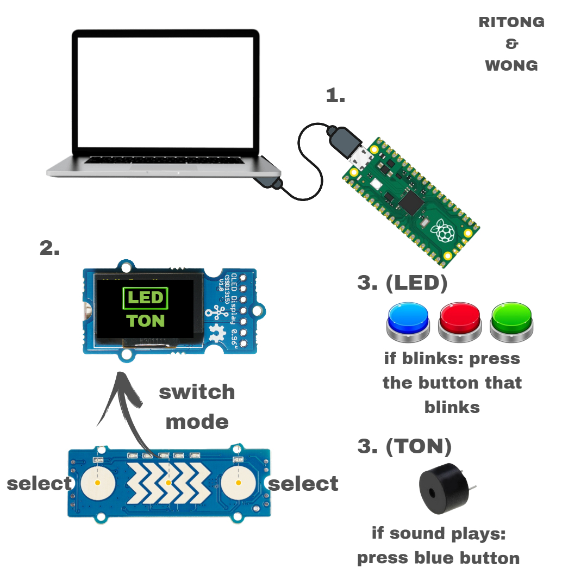

# Concept - `<Light Up>`

Auf dem Display wird zuerst eine Auswahl zwischen LED-Test oder Ton Test angezeigt. Mit dem Slider kann man den Modus, mit dem man spielen will, auswählen. Bestätigt wird das mit einer der Button auf dem Slider. Dann wird je nach Modus entweder das LED aufleuchten oder der Buzzer gibt einen Ton von sich.LED Level 1: der rote Button leuchtet auf, sobald er leuchtet muss man versuchen so schnell wie möglich den roten Button zu drücken. Für den LED-Test gibt es ein zweites „schwierigeres Level“ bei dem 3 LED’s und 3 Buttons mit verschiedenen Farben verwendet werden. Wenn das erste Level zu Ende wird das zweite Level automatisch gestartet. Level 2: Sobald 1 LED leuchtet, muss der Spieler versuchen so schnell wie möglich den Button mit derselben Farbe zu drücken. Auch dieses Mal wird mit dem Timer gearbeitet. Die Zeiten werden auf einem Display angezeigt.

Was braucht man: `1 Arduino, 4 Buttons, 1 Slider, 1 Display und 4 LED’s`

Programmiersprache: `C`

Mock Up

