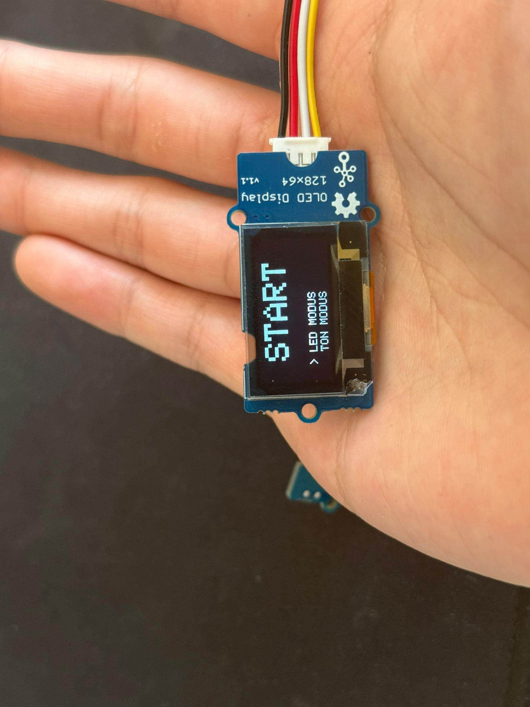

# Manual - `<Project NAME>`

Reaction Game Anleitung:

# Spielbeginn:

Nun bist du im Startmenü

 

Jetzt kannst du entweder den LED Modus oder Ton Modus (falls möglich) auswählen

Um das Spiel zu starten, musst du einen der drei Buttons betätigen

Nun läuft der Timer 10 Sekuden lang

Drücke auf die Buttons, die aufleuchten, du hast 2 Sekunden Zeit den Buttons zu betätigen, sonst verschwindet er

Nachdem die 10 Sekunden vorbei sind, wird dein Punktestand angezeigt

Spiel ist beendet

Nach einigen Sekunden bist du wieder im Startmenü
